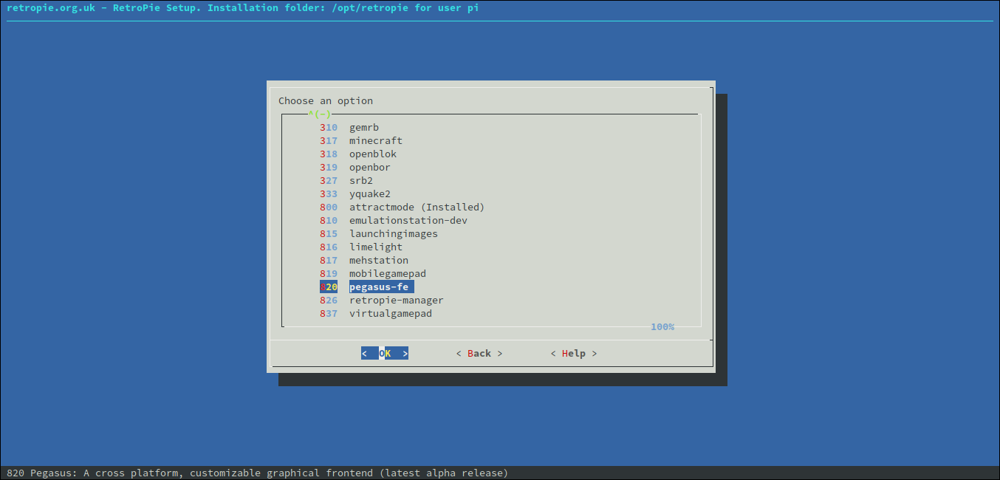
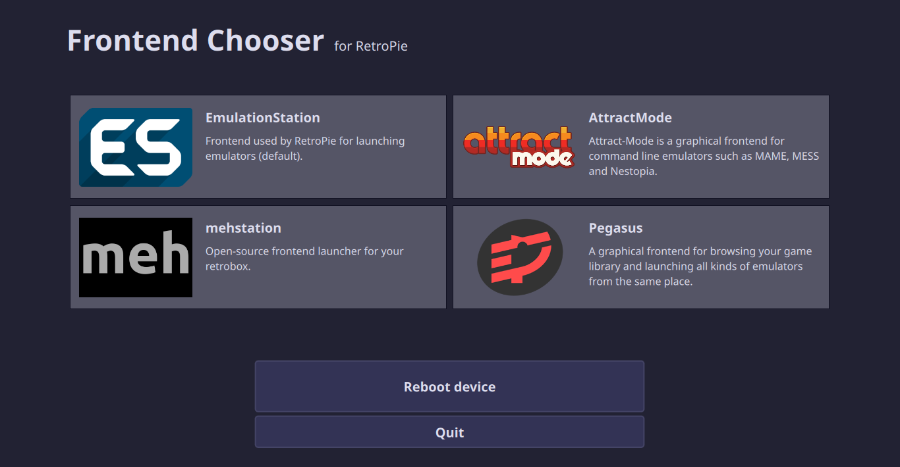

# Platform Notes: Raspberry

On the Raspberry Pi, the official builds require **Raspbian Buster or later**. All Raspberry boards are supported, however the releases are generally not interchangeable: trying to launch an executable made for a different device will result in `Illegal instruction` errors.

Pegasus requires at least 64 MB of video RAM. You can change the memory split of the Raspberry Pi using `raspi-config`.


## Raspbian

AS Raspbian is also a Debian-based distribution, you can follow the [Linux intrustions](platform-linux.md) here as well. A desktop installation (X11) is not required, so you can also use the "Lite" versions of Raspbian on your boards. If you don't use X11, you don't need to install any of the `libxcb-` packages either.


## RetroPie

For Raspberry Pi devices Pegasus is also available from the RetroPie repositories. You can install it by two ways:

- a) From the RetroPie setup menu
- b) Using the Frontend Chooser tool

!!! note
    You will need RetroPie version **4.6** (released on April 28, 2020) or later to successfully install Pegasus.

### From the setup menu

You can start the RetroPie setup script from the terminal (`sudo ~/RetroPie-Setup/retropie_setup.sh`) or from another already installed frontend. You will be greeted with a text-based interface.

To install Pegasus, select *Manage Packages &rarr; Manage experimental packages &rarr; pegasus-fe &rarr; Install from binary*. The latest release will then be downloaded. You can also update your existing installation here.



After the installation, you can either call `pegasus-fe` manually, or edit `/opt/retropie/configs/all/autostart.sh` to launch Pegasus on boot (instead of eg. ES2).

### Using the Frontend Chooser

There's also a graphical tool for installing various frontend and setting them up to boot automatically. It is available from [HERE](https://github.com/mmatyas/retropie-frontendchooser).




## GPU driver notes

On the **Raspberry Pi 4** you have to define the `QT_QPA_EGLFS_KMS_ATOMIC` environment variable before launching Pegasus:

`export QT_QPA_EGLFS_KMS_ATOMIC=1`

(You can type it in the terminal, if you're launching Pegasus from there, or write a script for launching. If this isn't set, you'll see `Could not queue DRM page flip on screen HDMI1` errors.)

To **improve gradient colors** on all Raspberries, define the `QT_QPA_EGLFS_FORCE888` environment variable:

`export QT_QPA_EGLFS_FORCE888=1`

By default Pegasus tries to match the **preferred resolution** of the display (eg. TV) and use the default one if there are multiple connected outputs. To fine tune this behaviour, you can create a JSON file with a content like this:

```json
{
    "outputs": [{
        "name": "HDMI1",
        "mode": "1280x720"
    }]
}
```

then tell Pegasus to use it like this:

`export QT_QPA_EGLFS_KMS_CONFIG=/path/to/my.json`

For more details, please visit [this site](https://doc.qt.io/qt-5/embedded-linux.html#eglfs-with-the-eglfs-kms-backend).

